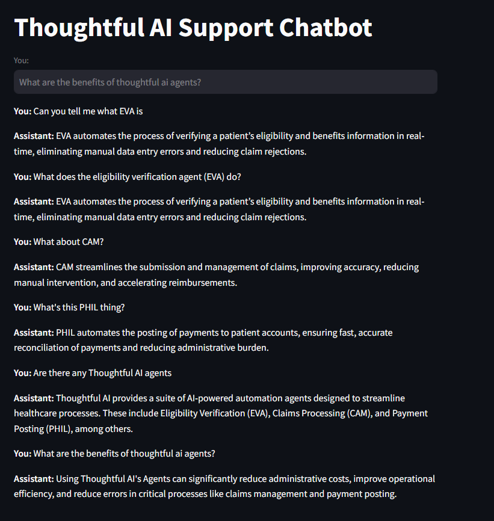

# Thoughtful AI Customer Support Agent

This project implements a customer support AI agent for Thoughtful AI using a Retrieval-Augmented Generation (RAG) strategy. It leverages OpenAI's API for response generation and uses SentenceTransformers for generating embeddings.

## Demo Screenshot



## Features

- **Retrieval-Augmented Generation (RAG)**: Combines information retrieval with generative AI to provide accurate and contextually relevant responses.
- **Streamlit Interface**: A user-friendly web application built with Streamlit for interactive conversations.
- **Predefined Knowledge Base**: Contains a set of predefined questions and answers about Thoughtful AI's agents.
- **Customizable Threshold**: Adjust the similarity match threshold to fine-tune the retrieval sensitivity.

## Prerequisites

Before running the application, ensure you have the following:

1. **Python 3.7 or Higher**

   - Verify your Python version:

     ```bash
     python --version
     ```

2. **OpenAI Account and API Key**

   - Sign up for an [OpenAI account](https://platform.openai.com/).
   - Obtain your API key from the [OpenAI dashboard](https://platform.openai.com/account/api-keys).
   - Keep your API key secure and do not expose it publicly.

## Setup

1. **Clone the Repository**

   ```bash
   git clone https://github.com/yourusername/thoughtful-ai-demo.git
   cd thoughtful-ai-demo
   ```

2. **Create a Virtual Environment** (Optional but Recommended)

   ```bash
   python -m venv .venv
   # Activate the virtual environment:
   # On Windows:
   .venv\Scripts\Activate.ps1
   # On macOS/Linux:
   source .venv/bin/activate
   ```

3. **Install Dependencies**

   ```bash
   pip install -r requirements.txt
   ```

4. **Set Up Environment Variables**

   Create a `.env` file in the root directory of the project with the following content:

   ```dotenv
   OPENAI_API_KEY=your-openai-api-key
   ```

   - Replace `your-openai-api-key` with your actual OpenAI API key.
   - Ensure that `.env` is included in your `.gitignore` file to prevent it from being committed to version control.

5. **Run the Application**

   Start the Streamlit app:

   ```bash
   streamlit run app.py
   ```

   - The application will open in your default web browser.
   - If it doesn't open automatically, navigate to `http://localhost:8501` in your browser.

## Using the Chat Interface

1. **Interact with the Agent**

   - You'll see a chat interface where you can type your questions about Thoughtful AI's agents.
   - Examples:

     - "What does the eligibility verification agent (EVA) do?"
     - "Can you explain what CAM is?"
     - "Tell me about your automation agents."

2. **Receive Responses**

   - The AI agent processes your input, retrieves relevant information from its knowledge base, and generates a response.
   - The response appears below your input in the chat interface.

3. **Continue the Conversation**

   - You can ask follow-up questions or new queries.
   - The conversation history is displayed for your reference.

**Note:** The agent is most knowledgeable about Thoughtful AI's products and services. For questions outside its knowledge base, it will attempt to provide a helpful response or inform you if it doesn't have the information.

## Customization

To expand or modify the agent's knowledge base:

1. **Add More Questions and Answers**

   - Open `generate_embeddings.py` and locate the predefined `qa_list`:

     ```python:generate_embeddings.py
     qa_list = [
         {
             "question": "What does the eligibility verification agent (EVA) do?",
             "answer": "EVA automates the process of verifying a patient’s eligibility and benefits information in real-time, eliminating manual data entry errors and reducing claim rejections."
         },
         # ... existing entries ...
         {
             "question": "Your new question?",
             "answer": "The answer to your new question."
         },
         # Add more entries as needed
     ]
     ```

   - **Explanation:** By adding new dictionaries to the `qa_list`, you expand the set of questions and answers that the agent can use to assist users.

2. **Regenerate Embeddings and Update Neo4j Database**

   **Why This Step Is Necessary**

   - After adding new questions, embeddings must be recalculated so that the agent can understand and retrieve the new information effectively.
   - The `generate_embeddings.py` script computes embeddings for all questions and stores them, along with the questions and answers, in the Neo4j database.

   **Steps to Follow**

   a. **Ensure Neo4j Is Running**

      - **Verification:** Make sure your Neo4j database server is up and accessible.
      - **Reasoning:** The script connects to Neo4j to store data. If Neo4j isn't running, the script will fail to establish a connection.

   b. **Configure Environment Variables**

      - Create or update your `.env` file with Neo4j connection details:

        ```dotenv:.env
        NEO4J_URI=bolt://localhost:7687
        NEO4J_USERNAME=your-neo4j-username
        NEO4J_PASSWORD=your-neo4j-password
        ```

      - **Explanation:** These variables allow `generate_embeddings.py` to connect securely to your Neo4j instance without hardcoding sensitive information.

   c. **Install Required Dependencies**

      - Ensure all necessary Python packages are installed:

        ```bash
        pip install -r requirements.txt
        ```

      - **Includes:** `neo4j`, `sentence-transformers`, `numpy`, `python-dotenv`.

   d. **Run the Embedding Script**

      - Execute the script in your terminal:

        ```bash
        python generate_embeddings.py
        ```

      - **What Happens During Execution:**

        - The script loads the `qa_list` and computes embeddings for each question using the `SentenceTransformer` model.
        - It connects to the Neo4j database using the credentials from your `.env` file.
        - **Data Handling:** The script clears existing data (`MATCH (n) DETACH DELETE n`) to prevent duplication before inserting the updated data.
        - Stores each question, its embedding, and the corresponding answer in the database.

      - **Dry Run Consideration:** Before running, ensure that deleting existing data is acceptable. If you need to preserve existing data, modify the script to update or append data instead of deleting.

3. **Restart the Application**

   - After updating embeddings:

     ```bash
     streamlit run app.py
     ```

   - **Reasoning:** Restarting the Streamlit app ensures it loads the latest data from the Neo4j database, including your new questions and answers.

4. **Verify the Update**

   - **Test the Agent:**

     - Open the chat interface in your browser.
     - Ask one of the new questions you added to confirm the agent responds correctly.

   - **Check Neo4j Directly (Optional):**

     - Use the Neo4j Browser to run a query like:

       ```cypher
       MATCH (q:Question) RETURN q.text LIMIT 10
       ```

     - **Purpose:** Verify that your new questions are stored in the database.

## Error Handling

The application includes basic error handling:

- **OpenAI API Errors:**
  - Displays an error message if there's an issue with generating responses.
  - Common issues include invalid API keys or exceeding rate limits.
- **General Exceptions:**
  - Catches and logs unexpected errors during execution.
  - Provides user-friendly messages in the interface.

## Performance Optimization

- **Batch Processing:**
  - Embeddings for predefined questions are computed in batches for efficiency.
- **Resource Management:**
  - Models and data are loaded once at startup to reduce latency.

## Security

- **API Key Management:**
  - Store your OpenAI API key securely using environment variables.
  - Do not hard-code sensitive information in the codebase.
- **Dependency Updates:**
  - Regularly update dependencies to incorporate security patches.

## Dependencies

All required Python packages are listed in `requirements.txt`.